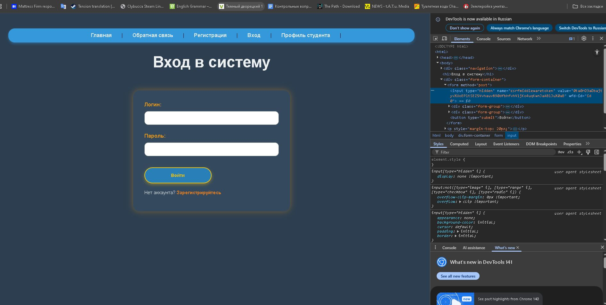
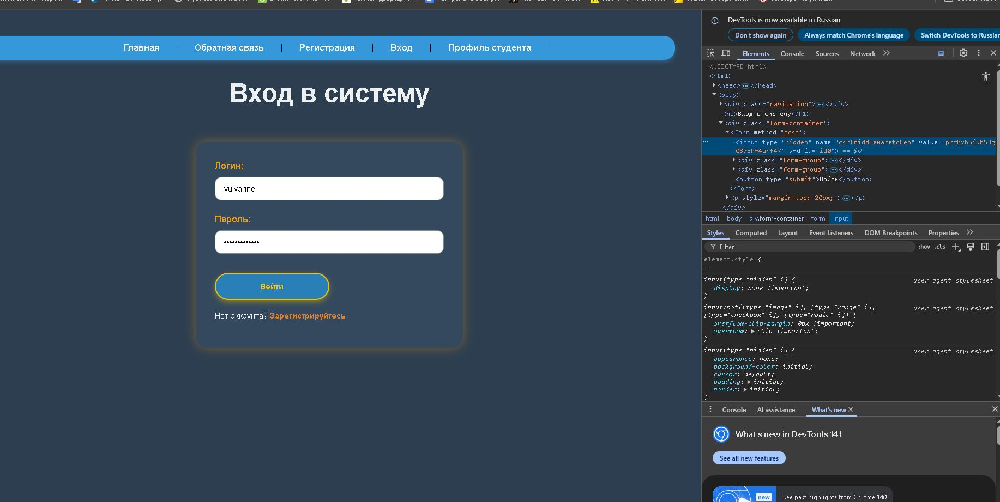
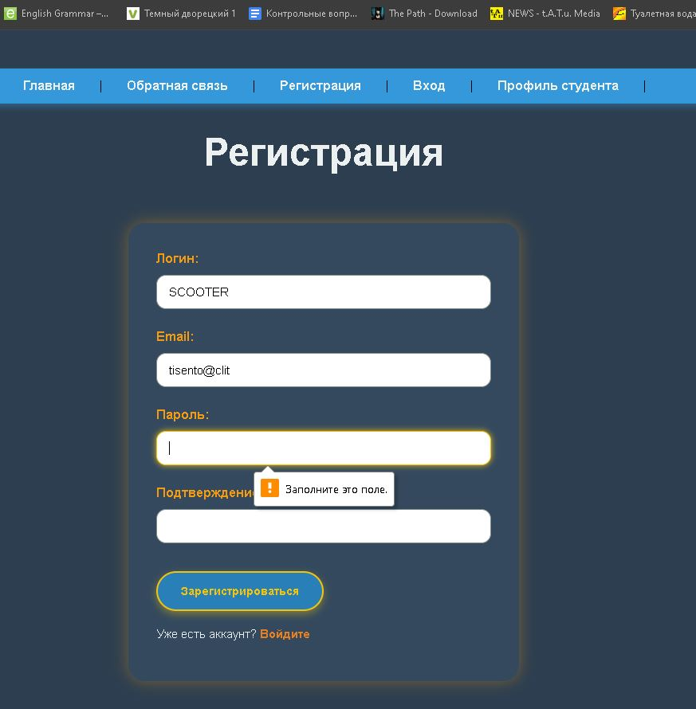
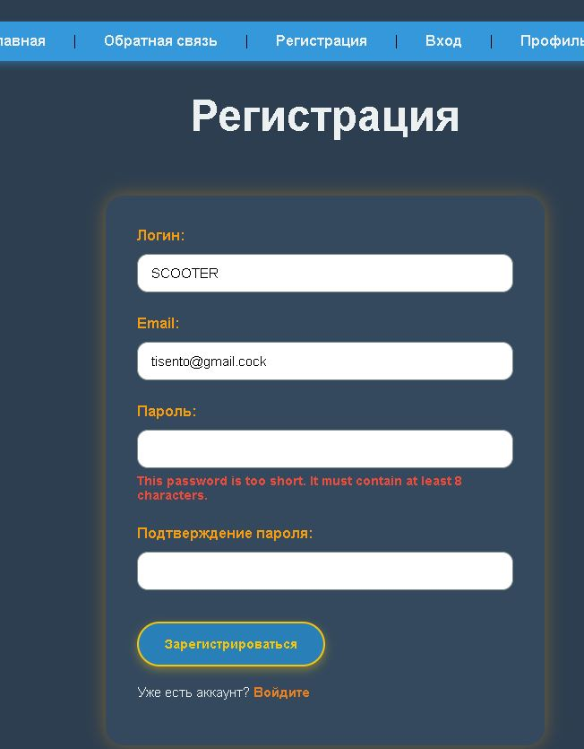
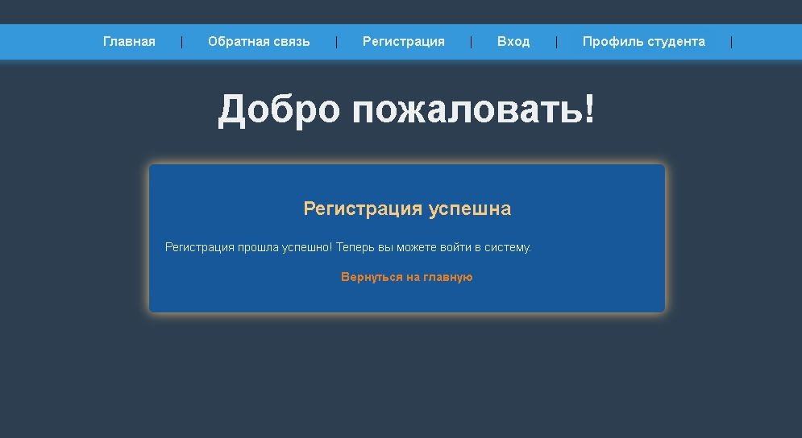
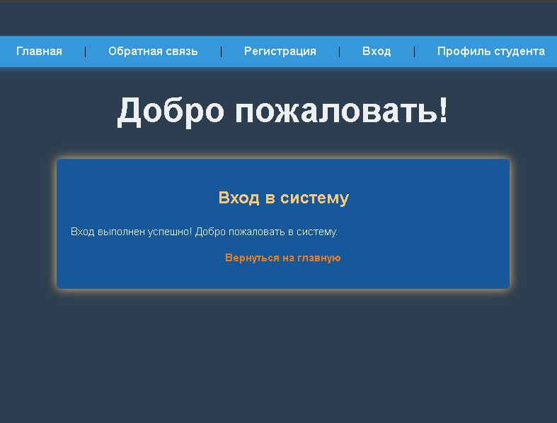
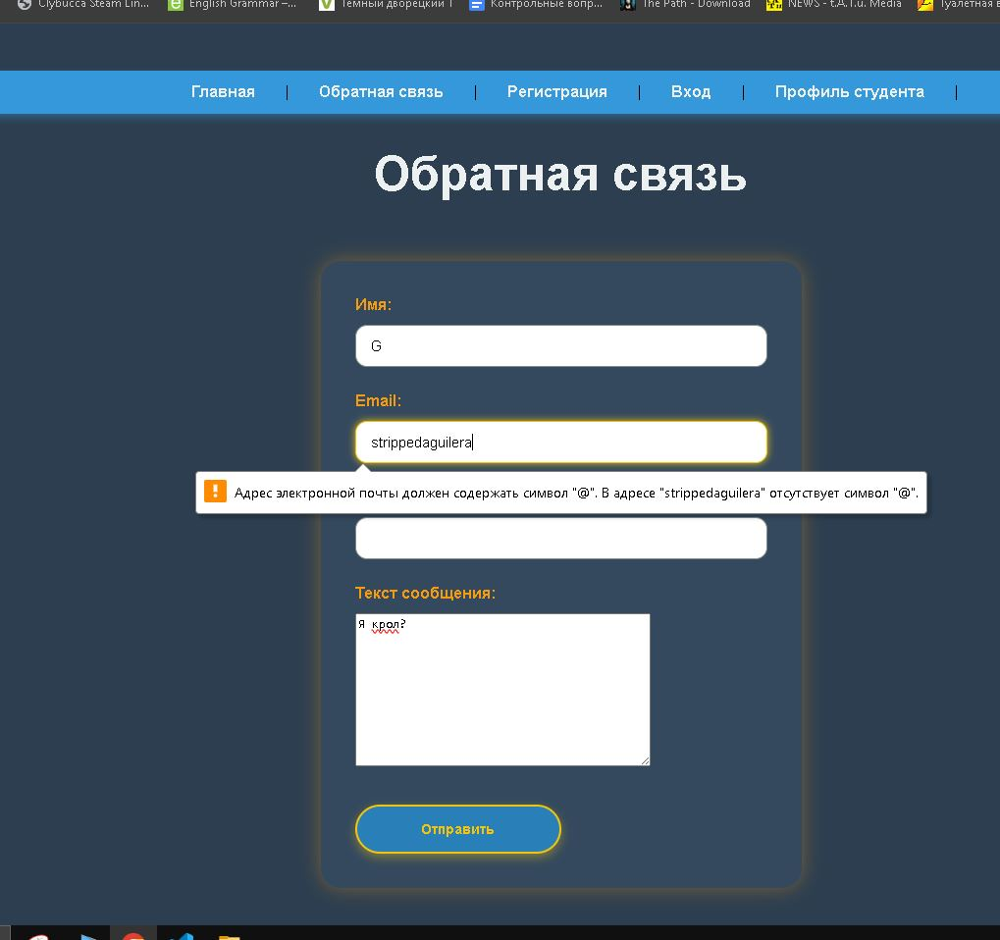
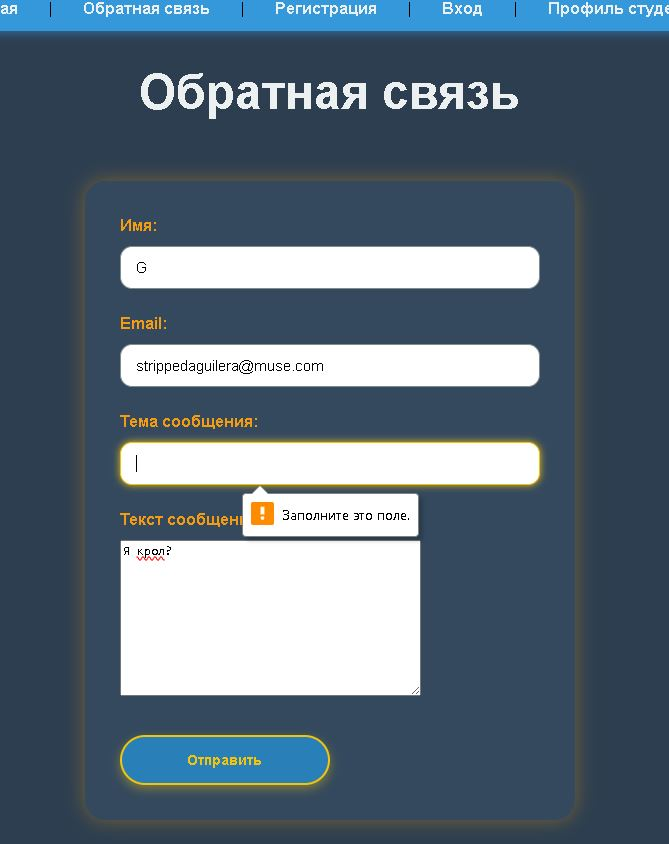
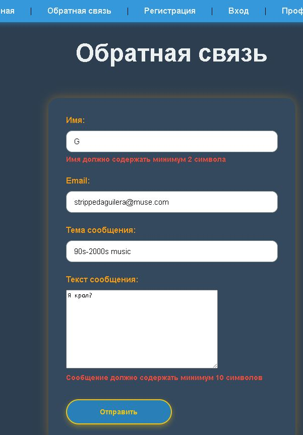
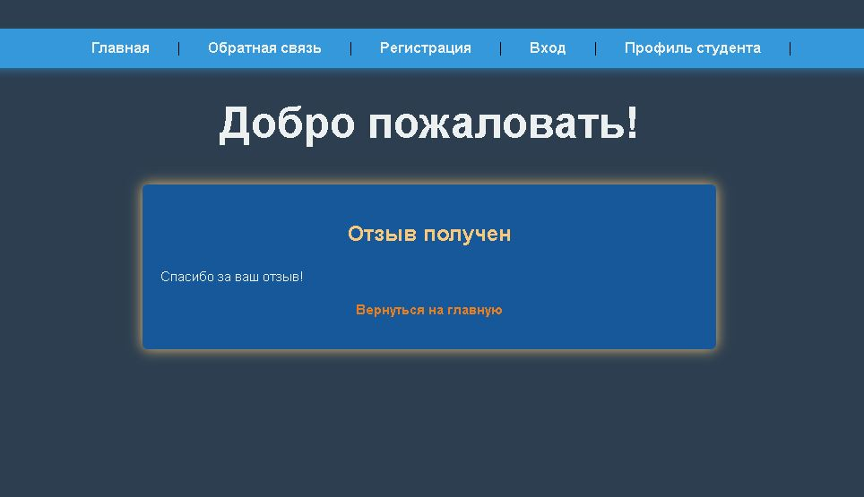

Лабораторная работа №2: Шаблоны, статические файлы, веб-формы и серверная обработка пользовательского ввода  

Завертан Андрей Сергеевич С9121-10.05.01ммзи  

ОПИСАНИЕ.

CSRF-защита  
В коде используется HTML-форма с методом POST, которая отправляет данные на тот же URL-адрес:  
```html
<form method="post">
    
    
        ...
    
</form>
```
Метод POST позволяет скрыть данные от отображения в адресной строке и безопасно передать их серверу для обработки. Тег `` вставляет в форму скрытый элемент с уникальным CSRF-токеном, который предотвращает межсайтовые запросы злоумышленников. При получении POST-запроса сервер проверяет этот токен, удостоверяясь, что запрос исходит с доверенного источника.  
Цикл `` перебирает все поля формы, переданной из views, и автоматически отображает элементы ввода с подписанными метками и обработкой ошибок. Такой подход упрощает работу с формами и валидацией на уровне шаблонов.  
Для проверки защиты можно изменить значение токена через инструменты разработчика, что вызовет ошибку 403 при отправке данных.





Форма регистрации  
```python
class RegistrationForm(forms.Form):
    username = forms.CharField(
        max_length=50,
        label='Логин',
        widget=forms.TextInput(attrs={'class': 'form-control'})
    )
    email = forms.EmailField(
        label='Email',
        widget=forms.EmailInput(attrs={'class': 'form-control'})
    )
    password = forms.CharField(
        label='Пароль',
        widget=forms.PasswordInput(attrs={'class': 'form-control'})
    )
    password_confirm = forms.CharField(
        label='Подтверждение пароля',
        widget=forms.PasswordInput(attrs={'class': 'form-control'})
    )
    def clean_username(self):
        username = self.cleaned_data['username']
        if User.objects.filter(username=username).exists():
            raise ValidationError("Пользователь с таким логином уже существует")
        return username

    def clean_email(self):
        email = self.cleaned_data['email']
        if User.objects.filter(email=email).exists():
            raise ValidationError("Пользователь с таким email уже существует")
        return email

    def clean_password(self):
        password = self.cleaned_data['password']
        validate_password(password)
        return password

    def clean(self):
        cleaned_data = super().clean()
        password = cleaned_data.get('password')
        password_confirm = cleaned_data.get('password_confirm')
        if password and password_confirm and password != password_confirm:
            self.add_error('password_confirm', "Пароли не совпадают")
```
В этой форме определены четыре поля: логин, email, пароль и подтверждение пароля, с соответствующими виджетами для удобства ввода и визуального оформления.  
Методы `clean_<fieldname>()` проверяют уникальность логина и email, а также сложность пароля с помощью встроенных валидаторов. Метод `clean()` проверяет совпадение пароля и подтверждения, добавляя ошибку при расхождении. Такой комплексный подход обеспечивает безопасную и правильную валидацию на сервере.  


  

Форма для входа  
```python
class LoginForm(forms.Form):
    username = forms.CharField(
        max_length=50,
        label='Логин',
        widget=forms.TextInput(attrs={'class': 'form-control'})
    )
    password = forms.CharField(
        label='Пароль',
        widget=forms.PasswordInput(attrs={'class': 'form-control'})
    )
    def clean(self):
        cleaned_data = super().clean()
        username = cleaned_data.get('username')
        password = cleaned_data.get('password')

        if username and password:
            user = authenticate(username=username, password=password)
            if user is None:
                raise forms.ValidationError("Неверный логин или пароль")
        return cleaned_data
    def get_user(self):
        return getattr(self, 'user', None)
```
Данный класс реализует форму авторизации, где пользователь вводит логин и пароль. Метод `clean()` выполняет проверку корректности учетных данных с использованием функции `authenticate`, вызывая ошибку при неверных данных. Метод `get_user()` используется для получения аутентифицированного пользователя после успешной проверки.  
Такой серверный контроль гарантирует безопасность и правильность входа.  

Успешный вход:  
 
 
Неверный пароль:  

Форма обратной связи  
```python
class FeedbackForm(forms.Form):
    name = forms.CharField(
        label='Имя',
        required=True,
        widget=forms.TextInput(attrs={'class': 'form-control'})
    )
    email = forms.EmailField(
        label='Email',
        required=True,
        widget=forms.EmailInput(attrs={'class': 'form-control'})
    )
    subject = forms.CharField(
        label='Тема сообщения',
        required=True,
        widget=forms.TextInput(attrs={'class': 'form-control'})
    )
    message = forms.CharField(
        label='Текст сообщения',
        required=True,
        widget=forms.Textarea(attrs={'class': 'form-control'})
    )

    def clean_name(self):
        name = self.cleaned_data['name']
        if len(name.strip()) < 2:
            raise ValidationError("Имя должно содержать минимум 2 символа")
        return name.strip()

    def clean_message(self):
        message = self.cleaned_data['message']
        if len(message.strip()) < 10:
            raise ValidationError("Сообщение должно содержать минимум 10 символов")
        return message.strip()
```
Форма содержит обязательные поля с атрибутами для ввода текста и электронной почты. Методы `clean_name` и `clean_message` проводят дополнительную проверку длины введенных данных, гарантируя минимальный объём информации для отправки.  






Обработчик профиля студента  
```python
def student_profile(request, student_id):
    if student_id in STUDENTS_DATA:
        student_data = STUDENTS_DATA[student_id]
        return render(request, 'student.html', {
            'student_id': student_id,
            'student_info': student_data['info'],
            'faculty': student_data['faculty'],
            'status': student_data['status'],
            'year': student_data['year']
        })
    else:
        return render(request, '404.html', status=404)
```
Этот view-функция принимает запрос и идентификатор студента, проверяет наличие данных в словаре `STUDENTS_DATA`. Если данные есть, рендерит страницу с информацией о студенте. При отсутствии — возвращает страницу ошибки 404.  

Обработка входа пользователя  
```python
def login_view(request):
    if request.method == 'POST': 
        form = LoginForm(request.POST) 
        if form.is_valid(): 
            user = form.get_user() 
            return render(request, 'success.html', { 
                'message': 'Вход выполнен успешно! Добро пожаловать в систему.',
                'title': 'Вход в систему'
            })
    else:
        form = LoginForm() 
    
    return render(request, 'login.html', { 
        'form': form, 
        'title': 'Вход в систему'
    })
```
Функция `login_view` обрабатывает метод POST, создавая и проверяя форму авторизации. В случае успешной валидации отображает страницу с подтверждением входа, в противном случае показывает форму на странице входа.  

Все функциональные элементы проверены и корректно работают.

Если необходимо, могу помочь с адаптацией или расширением отчёта.