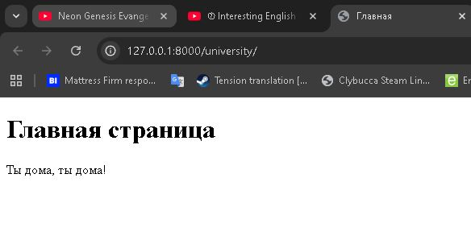
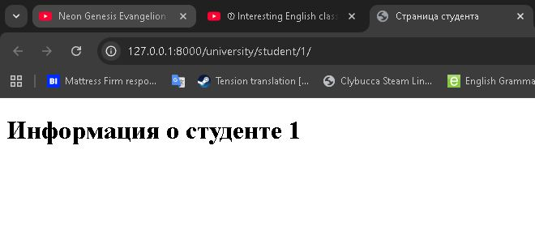
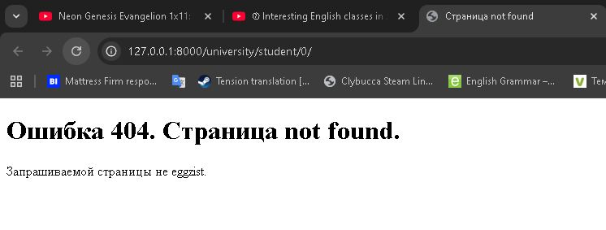

Лабораторная работа №1. Маршрутизация и представления
Завертан Андрей Сергеевич, С9121-10.05.01ммзи
В настройке маршрутизации urls.py описываются пути URL, по которым Django направит запросы к соответствующим функциям-представлениям (views). Параметры URL, например <int:student_id>, означают, что часть URL будет передана как целое число в функцию-представление. Обработчик handler404 указывает Django использовать функцию custom_404_view при возникновении ошибки 404.
В реализации представлений views.py функции-представления принимают запрос и возвращают HTTP-ответ с рендером определённого HTML-шаблона. В student_detail реализована проверка входного параметра student_id с обработкой ошибки.
custom_404_view позволяет показать пользователю кастомную страницу при ошибках "Страница не найдена".
Созданы шаблоны home.html, student_detail.html, и 404.html для отображения контента соответствующих страниц вместо plain text ответов ("university/templates").

